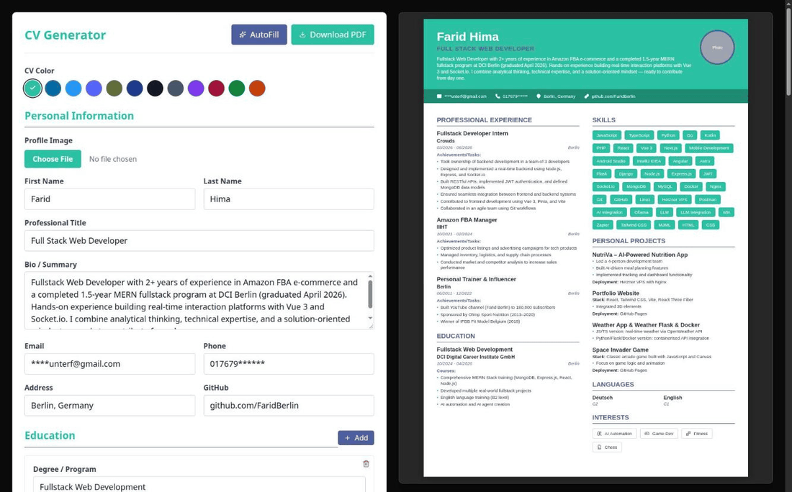
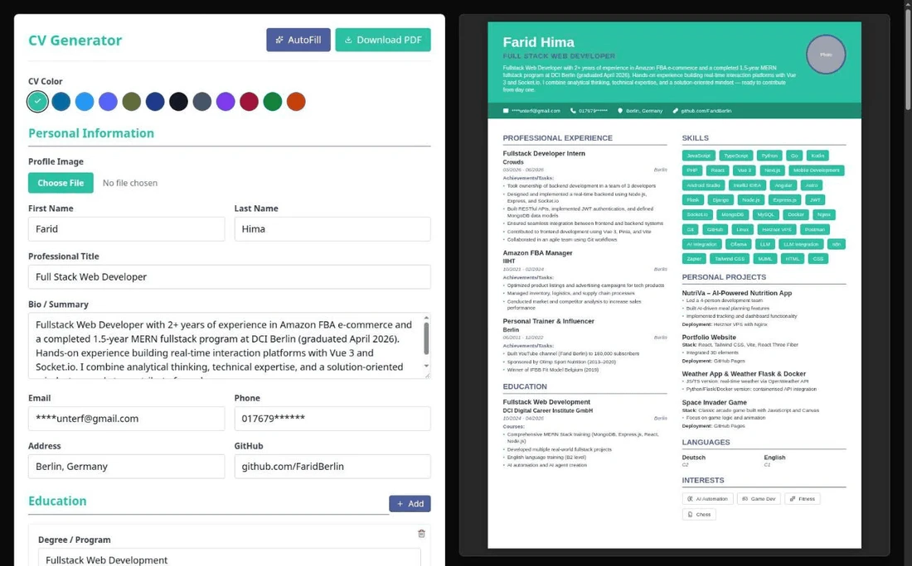
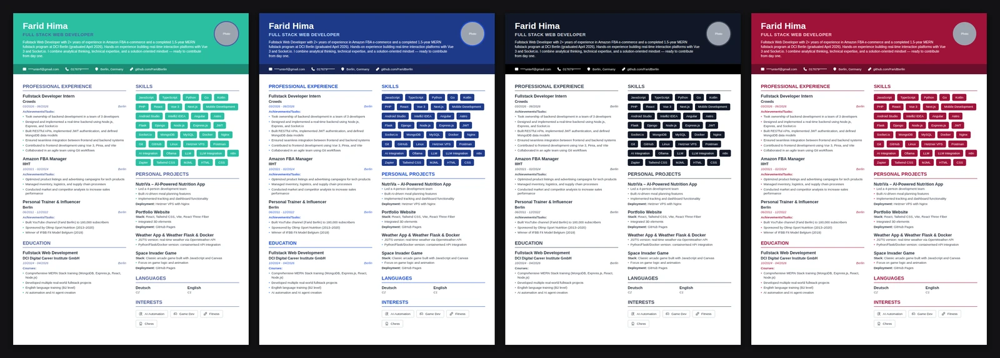

<h1 align="center">📑 CV Generator Application</h1>

<p align="center">
  
  
  
  
  
</p>

<p align="center">
  A modern, responsive CV/Resume creator built with React, TypeScript, and Vite
</p>

<p align="center">
  <a href="https://faridberlin.github.io/CV-Generator/"><b>🚀 Try the live demo</b></a>
</p>

<p align="center">
  
</p>

---

## 📋 Overview

An interactive React + TypeScript SPA for creating professional CVs/Resumes with real-time preview. Add, edit, and delete input fields to personalize your CV, with all changes reflected instantly in the preview. Export your finished CV as a real, text-based PDF (not a screenshot) with a single click. Includes an autofill feature for quick preview of a sample CV.

## 📸 Screenshots

**Edit on the left, see your A4 CV update live on the right**

<p align="center">
  
</p>

**Pick a color theme: it applies to the preview and the downloaded PDF**

<p align="center">
  
</p>

## ✨ Features

- **Live A4 Preview** - A true A4 sheet that scales to fit your screen, with page-break guides
- **12 Color Themes** - Choose your CV color; it applies to both the preview and the PDF, and is remembered between visits
- **Real-time Preview** - See your changes reflected instantly
- **Autofill Functionality** - Preview a pre-filled CV example
- **Responsive Design** - Works seamlessly on mobile, tablet, and desktop
- **Real PDF Export** - Download your CV as a vector PDF with selectable, searchable text (built with `@react-pdf/renderer`, not a rasterized screenshot)
- **Clean UI/UX** - Modern and intuitive interface, styled with Tailwind CSS
- **Dynamic Fields** - Add/remove work experience and skills entries
- **Form Validation** - Built-in input validation

## 🚀 Getting Started

### Prerequisites

- Node.js (v20 or higher recommended)
- npm

### Installation

1. Clone the repository:
```bash
git clone https://github.com/FaridBerlin/CV-Generator.git
cd CV-Generator
```

2. Install dependencies:
```bash
npm install
```

3. Start the development server:
```bash
npm run dev
```

4. Open [http://localhost:3000](http://localhost:3000) in your browser

### Building for Production

```bash
npm run build
```

The optimized production build will be in the `dist/` directory.

### Deployment

Deploy to GitHub Pages:
```bash
npm run deploy
```

## 💻 Technologies Used

- **React 19** - Modern React with hooks
- **TypeScript** - Static typing across the app
- **Vite** - Dev server and build tooling
- **Tailwind CSS 4** - Utility-first styling
- **@react-pdf/renderer** - Real, vector-based PDF generation
- **Vitest** - Testing
- **UUID** - Unique identifier generation

## 📚 What I Learned

- State management with React Hooks (useState)
- Functional components and modern React patterns
- Conditional rendering for responsive layouts
- Generating real, text-based PDFs with a React component tree
- Migrating a Create React App project to Vite + TypeScript
- Utility-first styling with Tailwind CSS
- Form handling and validation in React
- Mapping over array state for dynamic UI updates

## 🎯 Usage

1. **Fill Personal Information** - Enter your basic details (name, contact, bio)
2. **Add Education** - Include your educational background
3. **Add Work Experience** - Add multiple work experiences with details
4. **Add Skills** - List your technical and soft skills
5. **Preview in Real-time** - See your CV update as you type
6. **Download as PDF** - Click the download button to save your CV

## 🔧 Scripts

- `npm run dev` / `npm start` - Run development server
- `npm run build` - Type-check and create a production build
- `npm run preview` - Preview the production build locally
- `npm test` - Run tests
- `npm run lint` - Lint code
- `npm run format` - Format code with Prettier
- `npm run deploy` - Deploy to GitHub Pages

## 📱 Responsive Design

The application adapts to different screen sizes:
- **Desktop** - Side-by-side form and preview
- **Tablet** - Responsive layout with toggle
- **Mobile** - Toggle between form and preview views

## 🤝 Contributing

Contributions are welcome! Please feel free to submit a Pull Request.

## 📄 License

This project is open source and available under the MIT License.

## 👏 Acknowledgments

- Built as a learning project to master React state management
- Inspired by the need for a simple, free CV creator tool

---

<p align="center">Made with ❤️ using React</p>
